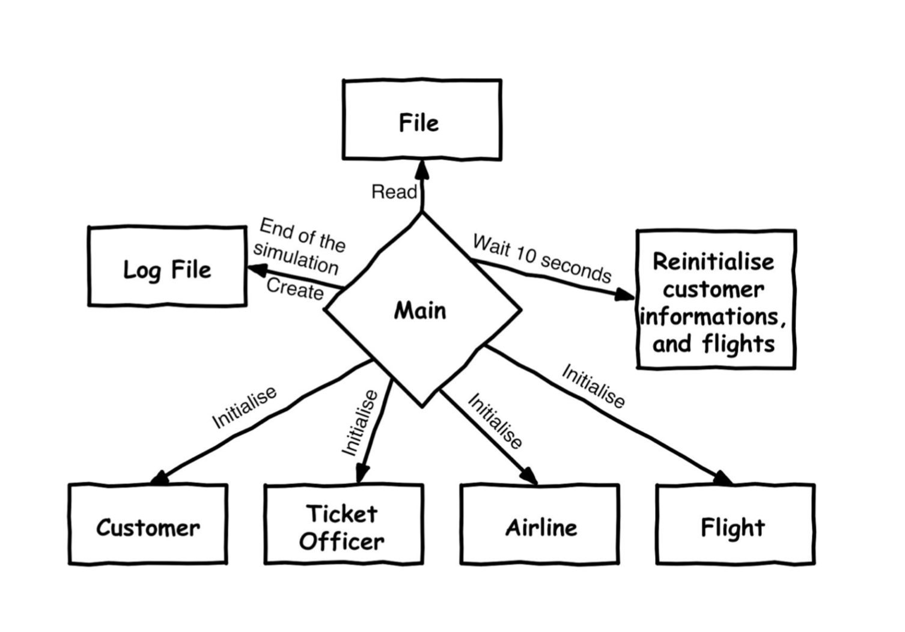
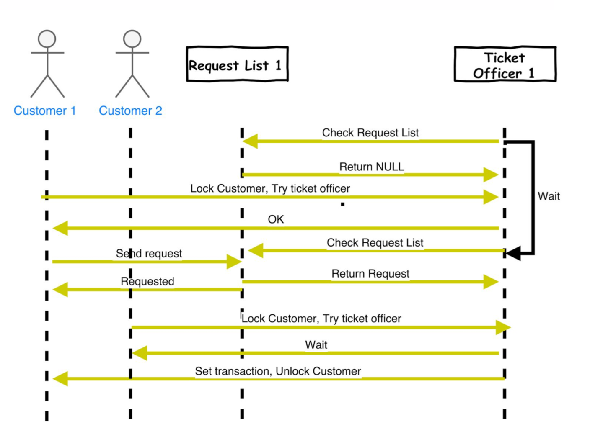

## Introduction

This document provides to understand given project which is as part of CSE4034 Advanced Unix Programming​ class. Aim of this project is to simulate a flight ticketing service by synchronizing the ticket sales, reservations and cancellations. Main purpose to do this project, understand how threads work, how to preserve consistencies, and how should be synchronised. Following parts of the document will give this information.

## Main Program

Main program manages the all operations. Firstly, it reads the input file and initialises the all variables. From the first line of file, it takes information about number of customers, ticket officers, airlines and flights and also number of simulation day. The remain rows present the information about customers. These are customer_id, max operation and max reservation numbers of given customer. If the input file does not contain any information for a customer ID, then that account has the default limits, both of them should be equal to the three. After that, main program creates the lists of customers, customers’ reservation lists, ticket officers, ticket officers’ request list, airlines, flights, and transactions. If all of the information are done, main program creates customer and ticket officer threads. Each simulation day takes 10 seconds. Main program waits 10 seconds and initialises all datas again, this is done for each day till simulation is finished. At the end of simulation, it creates a log file which is same ordered with the project specification.

## Customer Thread

When customer thread is created by main program, it runs with unique customer id for each customer. Firstly, it understands ‘which customer is running me’. Then, it enters the infinite loop because all customers should run during the all simulation. It checks if day and current day variables are not equal it understands, ‘There is a change between days and I need to wait till both days are equal’. Then, it checks ‘Should I stop’ according to main program, it sends a signal via variable ‘this is the end’. Then, again customers enter the loop, but this loop ends if they used all operation counts because they have limited number of the operation. When customer passes the this condition, everything starts. Customers lock their mutexes because if they finished their operation loop starts again but they need to wait till ticket officers finish their transactions. This lock is unlocking after the transaction is created successfully. Then, they try to enter one of the ticket officers queue(request list), if they can enter, they lock to selected ticket officer because at the same time just one customer can enter the one ticket officer, and ticket officer can take just one customer same time. Customers choose operation randomly. If they choose 1, it means this is buy operation. So, they need to say which airline, which flights, and how many seats randomly they want to buy. So, they send a request to selected ticket officers with this information. If they choose second one, it means it is reservation operation, and again they send a request to the selected ticket officers with same information order like buy operation. But for this time there is an exception in here, if they want to reserve seats, firstly they need to control their max reservation number because it is limited. If they choose the third one, it means this is cancel reservation operation. They looks their reservations on reservation list, if it is exist they choose the first one and send a request. If they choose the four, it means this is nothing operation again they send a request. If some of the customers could not take a officer, they choose one of the ticket officer randomly and wait them.

## Ticket Officer Thread

When ticket officer thread is created by main program, it runs with unique ticket officer id for each ticket officer. It enters the infinite loop because all customers should run during the all simulation. It understands ‘which ticket officer is running me’. Ticket officers check their queue(request list), if it is null they need to wait. And it checks if day and current day variables are not equal it understands, ‘There is a change between days and I need to wait till both days are equal’. Then, it checks ‘Should I stop’ according to main program, it sends a signal via variable ‘this is the end’. When ticket officer passes the this condition, everything starts. Ticket officers lock their mutexes because they can take one customer at the same time. It is unlocking after the operation is done. From their request list, they take customers request and for buying and reserving they checks ‘Is it possible to finish this request for buying or reserving according to flights seat counts’. And for this operations, program needs to preserve datas, no one can access and change seat counts at the same time for this reason program needs to lock according to the flights. And also when reserve operation is processing, also customers’ reservation list is created. For cancel reservation, they find transaction and cancel reservation, also they add seat counts to the flight. For last operation, they just create a transaction. At the end, ticket officer unlocks given customer mutex for signaling the customer ‘It is done’.

Following diagrams demonstrate that how the system actually work:

